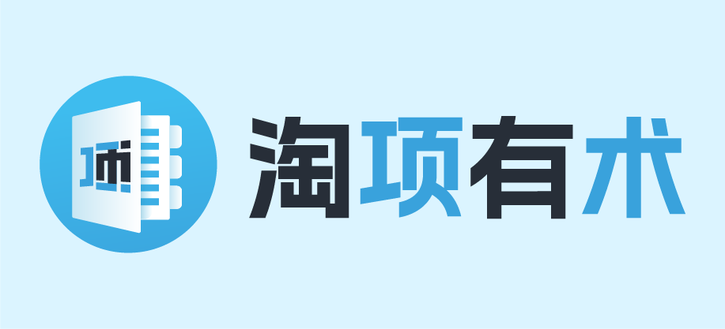
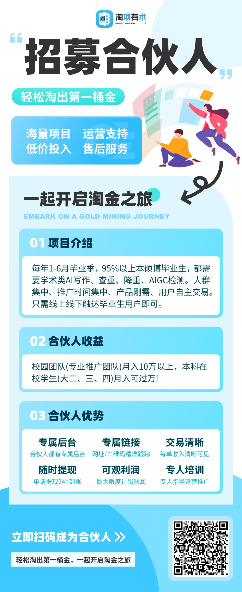

#

    

淘项有术系统---项目主题

    
    
    
     

####

---

### 🚀 版本目录

| 版本目录 | 说明    |
|------|-------|
| v1   | 第一套主题 |
| v2   | 第二套主题 |
| ...  | ...   |

---

### 📚 文件目录

| 文件目录            | 项目          | 简名（JANE_NAME） |
|-----------------|-------------|---------------|
| ai_paper_report | AI大师写作      | dsxz          |
| aigc_check      | Master AI检测 | aigc_check    |
| paper_check     | 论文查重        | paper_platform |
| zjchong         | 早降重         | zjchong       |
| rg_jiangchong   | 人工降重        | rg_jiangchong |
| super_resume    | 超级简历        | super_resume  |
| wxxz            | 文献下载        | wxxz          |
| ppt_moban       | PPT模版       | ppt_moban     |
| sci             | SCI投稿       | sci           |
| runse           | 润色          | runse         |
| ...             | ...         |               |

---

###  🔨 部署前必读

#### 一、替换USER_TOKEN *

1.获取自己的USER_TOKEN值：淘项有术后台-->开放平台-->API开放-->前端开放

2.搜索所有HTML文件，替换以下**USER_TOKEN**值为自己的USER_TOKEN值

    

#### 二、解决登录跨域（非必）

举例：

    AI大师写作：https://www.yourdomain.com
    原登录接口：https://api.taoxiangyoushu.com

问题：

    yourdomain.com与taoxiangyoushu.com域名不相同，存在跨域问题，用户无法登录。

解决方案：

    1.反向代理：将https://api.yourdomain.com（建议使用https），反向代理到https://api.taoxiangyoushu.com
    
    2.替换链接: 搜索所有HTML文件，替换以下**LOGIN_API_URL**值为https://api.yourdomain.com

        //原登录接口
        var LOGIN_API_URL = 'https://api.taoxiangyoushu.com';
    
        //替换如下
        var LOGIN_API_URL = 'https://api.yourdomain.com';

---

### 🚨 更新说明

点击查看<a href="https://admins.taoxiangyoushu.com/#/list/update" target="_blank">更新记录</a>

---
###  📱 系统演示

管理后台： [https://admins.taoxiangyoushu.com](https://admins.taoxiangyoushu.com/#/SignIn?code=e1KfZ510)

---

###  📱 项目演示

AI大师写作：https://www.dashixiezuo.com

论文查重：https://twjs-paper.taoxiangyoushu.com

早降重：https://www.zaojiangchong.net

Master AI检测：https://www.paperaigc.com

---

###  💾 版权信息

本项目包含的第三方源码和二进制文件之版权信息另行标注。

版权所有Copyright © 2025 by Taoxiangyoushu (https://www.taoxiangyoushu.com)

All rights reserved。

淘项有术® 商标和著作权所有者为 湖南淘项有术网络信息科技有限公司。

---